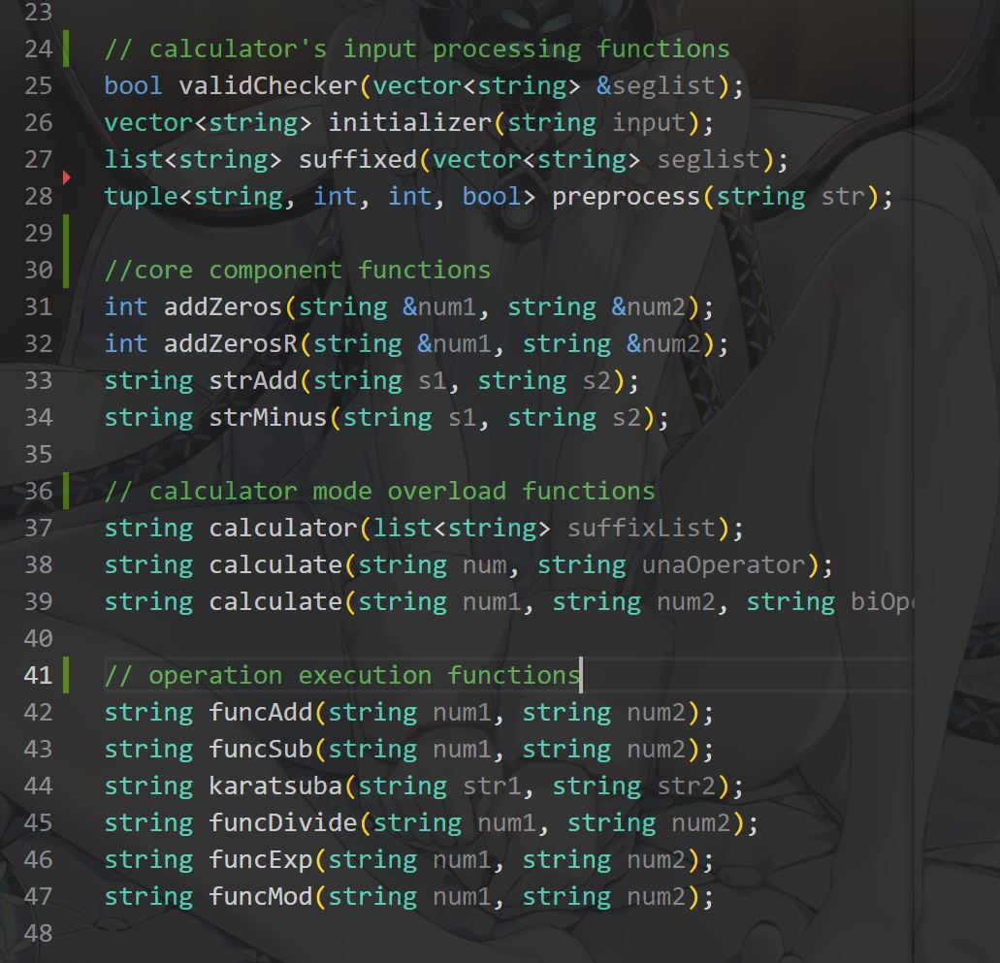
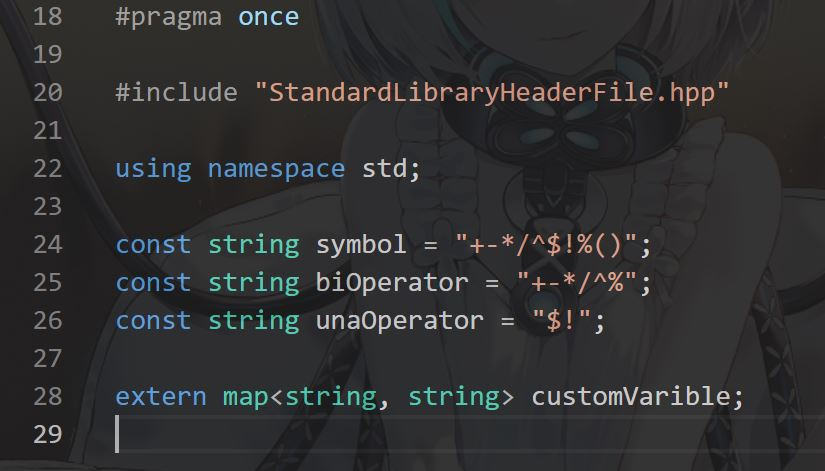
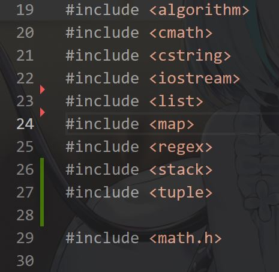
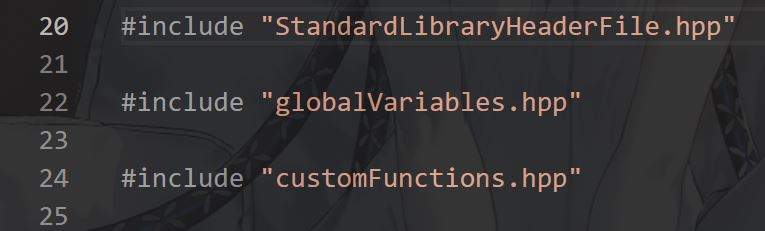
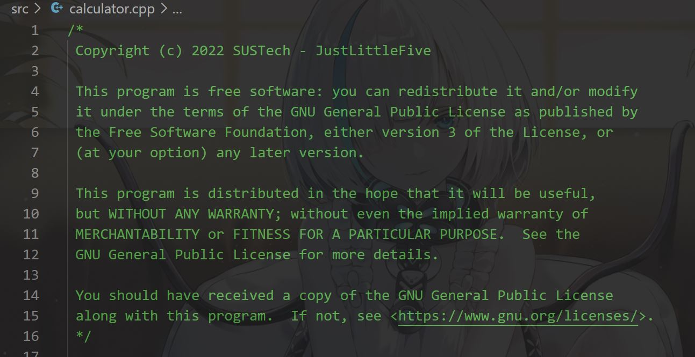
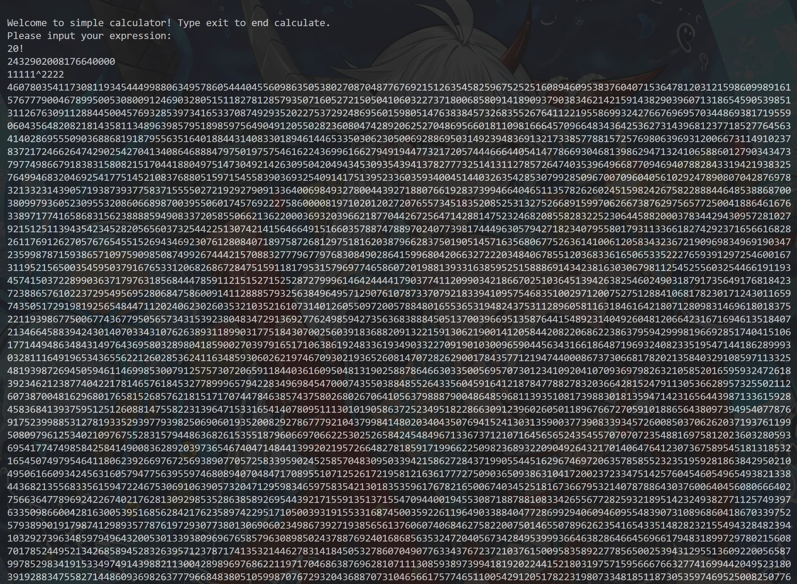
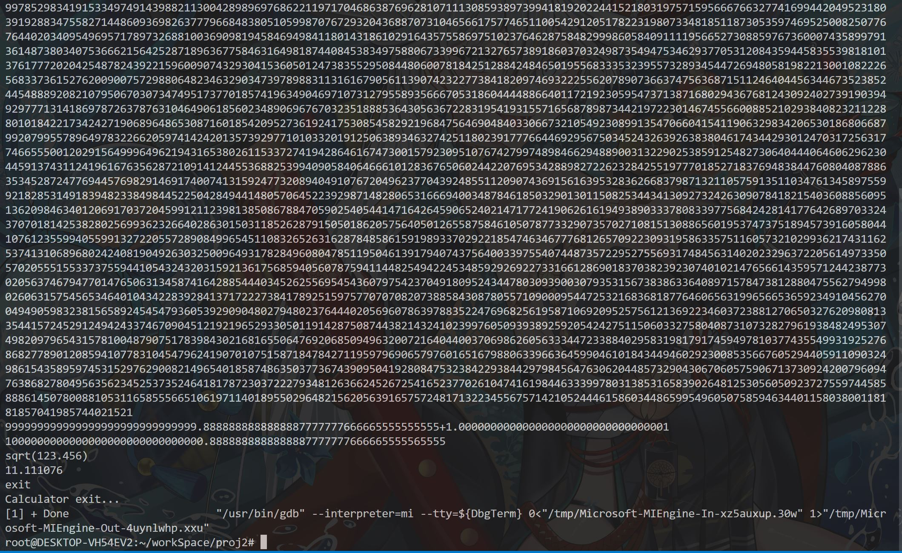

# CS205 C/ C++ Programming - Project 2 A Better Calculator
**Name:** Lv Yue  
**SID:** 11710420

***This project is hosted at https://github.com/JustLittleFive/simpleCalculator ***  

## Part1: Analysis  
Project goal: Implement a much better calculator than that in Project 1.   
  
It is envisaged that the calculator will support high precision addition + subtraction - multiplication * division / square root sqrt()->$ remainder % exponentiation ^ factorial ! operations.  
  
In addition, the calculator supports user-defined variables.

## Part2: Core code
The **customFunction.hpp** declare the *calculator's input processing functions*, *core component functions*, *calculator mode overload functions* and *operation execution functions*:  

  
<br>

The **globalVariables.hpp**, where a *map* is declared as *custom variable storage space* and multiple *operator string constants*:  

  
<br>

The **StandardLibraryHeaderFile.hpp**, contains all required standard library header files:  

  
<br>

Finally the **headerCollections.hpp**, collect all the headers, to make .cpp files #include once and for all:  

  
<br>

-----
The project file has a ***brand new copyright header*** (sorry for the copyright header error caused by my previous oversight!):

  
<br>
( My GitHub home page: *https://github.com/JustLittleFive* )  

The function implementation is divided into five project files:  
1. **simpleCalculator.cpp**: Main function, as the program entry, handles the assignment statement of the custom variable.  
2. **preprocess.cpp**: Preprocessing function implementation. Not only processing user input, but also preprocessing functions for scientific notation and decimal point are here.  
3. **calculator.cpp**: Manages the order in which expressions are evaluated (suffix expression), and the overloaded calculate function handles unary and binary operators separately.  
4. **calFunc.cpp**: The corresponding operation functions are implemented for all supported operators. Some temporarily unsupported inputs are also processed here.  
5. **calComponents.cpp**: The common core component that implements string-type mathematical operations, and is used in almost every operator's implementation function.  


... and the ***Karatsuba multiplier*** in **calFunc.cpp**: 
```C++
/// @brief Multiply function by Karatsuba algorithm, inspired by the article
/// https://www.geeksforgeeks.org/karatsuba-algorithm-for-fast-multiplication-using-divide-and-conquer-algorithm/
/// @param str1
/// @param str2
/// @return string
string karatsuba(string num1, string num2) {
  ...

  int subLen = len / 2;
  string a = str1.substr(0, subLen);
  string b = str1.substr(subLen, len - subLen);
  string c = str2.substr(0, subLen);
  string d = str2.substr(subLen, len - subLen);

  string ac = karatsuba(a, c);
  string bd = karatsuba(b, d);
  // string acPbd = strAdd(ac, bd);
  // string adPbc = strAdd(karatsuba(a, d), karatsuba(b, c));
  string aPbcPd = karatsuba(strAdd(a, b), strAdd(c, d));
  string adPbc = strMinus(aPbcPd, strAdd(ac, bd));

  int bitShift = len - subLen;
  for (int i = 0; i < bitShift * 2; i++) {
    ac = ac + '0';
  }
  for (int i = 0; i < bitShift; i++) {
    adPbc = adPbc + '0';
  }

  result = strAdd(strAdd(ac, adPbc), bd);

  ...
}
```

*There are many more annotations in the code too!*  


## Part 3: Result & Verification


<br>
*Some functions still lack support for precision,scientific notation or decimals.*  

## Part 4 - Difficulties & Solutions
1. In order to ensure precision and no data loss, using string as an operator operation object requires rewriting the basic operation logic.  
2. Code analysis somtimes shows that there are still riskes to be resolved: bunch of "Potential leak of memory", but I didn't use any ```new``` in my functions.  
3. List in C++ is implemented in the form of linked list, which is different from other programming languages.  
4. C++'s requirement that functions have only one return value forced me to use pointers and references.  
5. Implementing support for scientific notation and decimals for various operators is more complicated than I thought.  